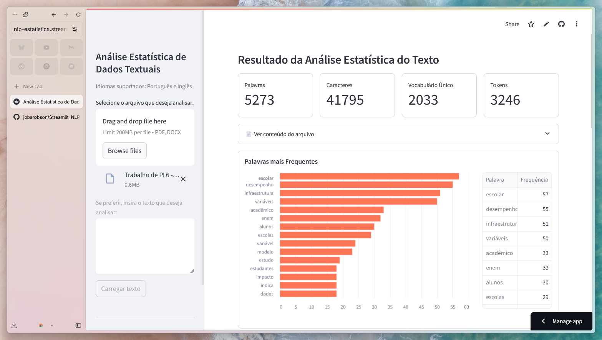

# Análise Estatística de Textos em Streamlit  

Este repositório contém uma aplicação web interativa desenvolvida com **Streamlit** para análise estatística de textos. A aplicação suporta arquivos **PDF** e **DOCX**, além de textos da área de transferência, oferecendo insights como contagem de palavras, bigramas, nuvem de palavras e métricas estatísticas.

  

📌 **Projeto desenvolvido para a disciplina de _Tópicos em NLP_**, ministrada pelo [Prof. Alexandre Vaz](https://github.com/alexvaroz) no curso de **Ciência de Dados e Inteligência Artificial** do **IESB**.  

## 🚀 Funcionalidades  

✅ Upload de arquivos de texto (PDF/DOCX) em Português ou Inglês!  
✅ Exibição da contagem de palavras, caracteres, tokens e vocabulário único  
✅ Gráficos interativos  
✅ Geração de **nuvem de palavras** personalizada  
✅ Extração e visualização de **bigramas e trigramas**  
✅ Exportação dos resultados  

## 🛠 Uso  

Acesse a aplicação web atráves [deste link](https://nlp-estatistica.streamlit.app/).

## 📜 Licença

Este projeto está licenciado sob a Licença GNU-3. Consulte o arquivo LICENSE para mais detalhes.

 

🎯 Desenvolvido com 💡 e 🚀 para facilitar a análise de textos!
